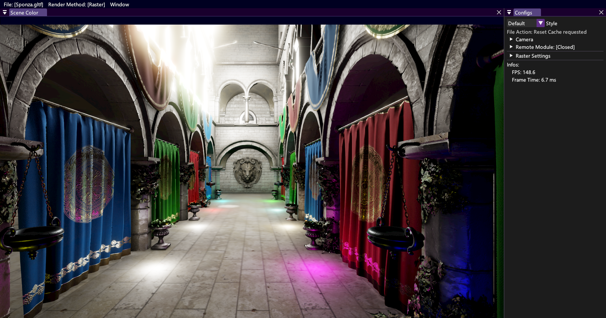
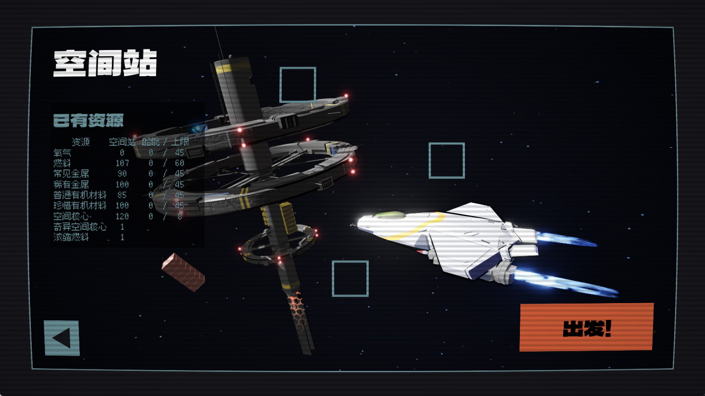
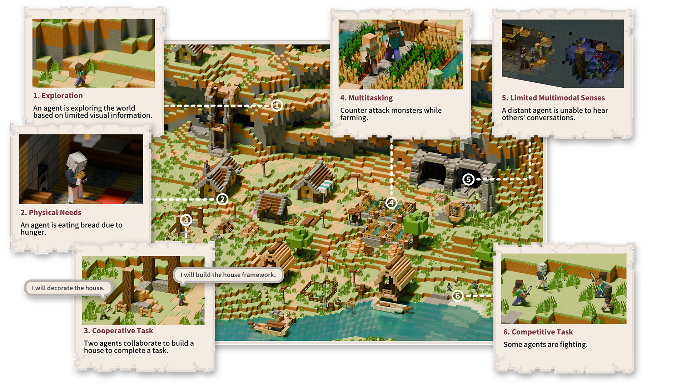
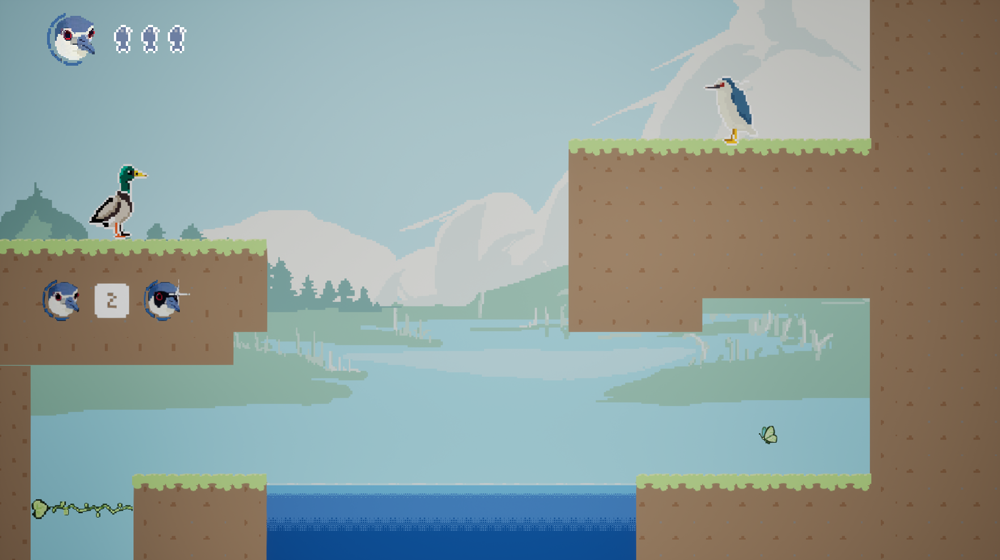

## Hi there, this is YXHXianYu 👋

I'm an otaku who interested in video games, competitive programming, and computer graphics.

* **Competitive Programming**
  * Former team leader of Beijing Jiaotong University's ACM Team.
  * 3 Gold Medals 🥇🥇🥇 in Regional Competitions (2 ICPC Regionals, 1 CCPC Regional). Max 2187 rating on [CodeForces](https://codeforces.com/profile/YXH_XianYu)
  * Here is my XCPC Template ([link](https://github.com/YXHXianYu/YXHXianYu-XCPC-Template)) and my Career Review (退役小作文) ([link](https://yxhxianyu.fun/2024/06/06/%E8%87%B4%E6%88%91%E7%9A%84%E5%85%AB%E5%B9%B4%E7%AE%97%E6%B3%95%E7%AB%9E%E8%B5%9B%E7%94%9F%E6%B6%AF/)).
* **Computer Graphics**
  * **Moer Engine**: a Render Engine with Vulkan, RHI, Real-time RayTracing, etc..([link](https://github.com/NJUCG/MoerEngine))
  * BJTU Game Engine: a renderer using C++ & OpenGL ([link](https://github.com/YXHXianYu/BJTU-Game-Engine))
  * Sasaki Shaders: a Minecraft Shaderpacks ([link](https://github.com/YXHXianYu/Sasaki-Shaders))
* **ACGNM** (二次元)
  * [Here](https://steamcommunity.com/id/yxh_xianyu/) is my Steam Profile.
    * Top 5 Video Game: *TODO*
  * [Here](https://bangumi.tv/user/yxhxianyu) is my Bangumi Profile.
    * Top 5 Galgame (Visual Novel): 鸣潮, 十三机兵防卫圈, 命运石之门, FLOWERS, 9-nine...
    * Top 6 Anime: 白色相簿2, 边缘行者, 孤独摇滚, 葬送的芙莉莲, 京吹, 来自深渊...

***

* My Blog: I write blogs sometimes, including: essays, novels, game/anime reviews, and technology. ([link](https://yxhxianyu.fun/))
* My Email: yxhxianyu@qq.com
* [This Docs](./Projects.md) records all my projects about Game Development.

<table>
  <tr>
    <td width="50%" align="center">
       
      [<a href="https://github.com/NJUCG/MoerEngine">MoerEngine 实时渲染引擎</a>]
    </td>
    <td width="50%" align="center">
       
      [<a href="https://github.com/Majowaveon/Drift">裂隙迷航 搜打撤独游</a>]
    </td>
  </tr>
  <tr>
    <td width="50%" align="center">
       
      [<a href="https://github.com/cocacola-lab/MineLand">MineLand 大模型智能体的Minecraft接口</a>]
    </td>
    <td width="50%" align="center">
       
      [<a href="https://github.com/Majowaveon/WhatBird">啥鸟?! 平台跳跃独游</a>]
    </td>
  </tr>
</table>
